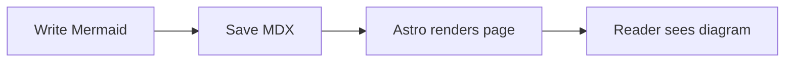

## Markdown

Text can be **bold**, *italic*, ~~strikethrough~~, and ***~~all at the same time~~***.

There should be whitespace between paragraphs[^1].

# Heading 1
## Heading 2
### Heading 3
#### Heading 4
##### Heading 5
###### Heading 6

This is a normal paragraph[^2] following a header.

😭😂🥺🤣❤️✨🙏😍🥰😊

```
Long, single-line code blocks should not wrap. They should horizontally scroll if they are too long. This line should be long enough to demonstrate this.
```

> "Original content is original only for a few seconds before getting old"
> > Rule #21 of the internet

- Item 1
- Item 2
  - Item 2.1
  - Item 2.2
- Item 3
- `Item 4`

1. Perform step #1
2. Proceed to step #2
3. Conclude with step #3

- [ ] Milk
- [x] Eggs
- [x] Flour
- [ ] Coffee
- [x] Combustible lemons

| Mare         | Rating            | Additional info  |
| :----------- | :---------------- | :--------------- |
| Fluttershy   | Best pone         | Shy and adorable |
| Apple Jack   | Good pone         | Honest and nice  |
| Pinkie Pie   | Fun pone          | Parties and ADHD |
| Twilight     | Main pone         | Neeerd           |
| Rainbow Dash | Yes               | Looks badass     |
| Rarity       | Fancy pone        | Generous         |
| Derpy Hooves | *M u f f i n s*   | [REDACTED]       |

```rust
let highlight = true;
```

```css showLineNumbers startLineNumber=10 {3-4,8-9}
pre mark {
  // If you want your highlights to take the full width
  display: block;
  color: currentcolor;
}
pre table td:nth-of-type(1) {
  // Select a colour matching your theme
  color: #6b6b6b;
  font-style: italic;
}
```

#### Alerts

Available alert types:

- `note`: Useful information that users should know, even when skimming content.
- `tip`: Helpful advice for doing things better or more easily.
- `important`: Key information users need to know to achieve their goal.
- `warning`: Urgent info that needs immediate user attention to avoid problems.
- `caution`: Advises about risks or negative outcomes of certain actions.

```html
<Alert type="note">
Note alert text
</Alert>
```
<Alert type="note">
Note alert text
</Alert>

<Alert type="important">
Important alert text
</Alert>

<Alert type="tip">
Tip alert text
</Alert>

<Alert type="warning">
Warning alert text
</Alert>

<Alert type="caution">
Caution alert text
</Alert>

#### Images and Videos

By default images and videos come with some generic styling, such as rounded corners and shadow. To fine-tune these, you can use shortcodes with different variable combinations.

Available variables are:

- `url`: URL to an image.
- `url_min`: URL to compressed version of an image, original can be opened by clicking on the image.
- `alt`: Alt text, same as if the text were inside square brackets in Markdown.
- `full`: Forces image to be full-width.
- `full_bleed`: Forces image to fill all the available screen width. Removes shadow, rounded corners and zoom on hover.
- `start`: Float image to the start of paragraph and scale it down.
- `end`: Float image to the end of paragraph and scale it down.
- `pixels`: Uses nearest neighbor algorithm for scaling, useful for keeping pixel-art sharp.
- `transparent`: Removes rounded corners and shadow, useful for images with transparency.
- `no_hover`: Removes zoom on hover.
- `spoiler`: Blurs image until hovered over/pressed on, useful for plot rich game screenshots.
- `spoiler` with `solid`: Ditto, but makes the image completely hidden.

```html
<ImageCode
  url="image.png"
  alt="This is an image"
  no_hover="true"
/>
```

<figure>
  <ImageCode
    url = "https://i1.theportalwiki.net/img/2/23/Ashpd_blueprint.jpg"
    alt = "Portal Gun blueprint"
    no_hover = "true"
  />
  <figcaption>Image with an alt text and without zoom on hover</figcaption>
</figure>

<figure>
  <ImageCode
    url = "https://upload.wikimedia.org/wikipedia/commons/b/b4/JPEG_example_JPG_RIP_100.jpg"
    url_min = "https://upload.wikimedia.org/wikipedia/commons/3/38/JPEG_example_JPG_RIP_010.jpg"
    alt = "The gravestone of J.P.G."
    no_hover = "true"
  />
  <figcaption>Image with compressed version, an alt text, and without zoom on hover</figcaption>
</figure>

<figure>
  <ImageCode
    url = "https://files.catbox.moe/lk7nee.jpg"
    alt = "Portal Gun blueprint"
    spoiler = "true"
  />
  <figcaption>Image with an alt text, hidden behind a spoiler</figcaption>
</figure>

<figure>

[](https://containertoolbx.org)
<figcaption>Full-width image with an alt text, pixel-art rendering, no shadow and rounded corners, and no zoom on hover</figcaption>
</figure>

<br />


Lorem ipsum dolor sit amet, consectetur adipiscing elit, sed do eiusmod tempor incididunt ut labore et dolore magnam aliquam quaerat voluptatem. Ut enim aeque doleamus animo, cum corpore dolemus, fieri tamen permagna accessio potest, si aliquod aeternum et infinitum impendere malum nobis opinemur.

\
[](https://unsplash.com/photos/a-mountain-lake-surrounded-by-trees-and-snow-CqTOTZh5vrs)

For videos it's all the same except for a few differences: `no_hover` and `url_min` variables are not available.

Additionally, the following [attributes](https://developer.mozilla.org/en-US/docs/Web/HTML/Element/video#attributes) can be set:

- `autoplay`: Start playing the video automatically.
- `controls`: Display video controls such as volume control, seeking and pause/resume.
- `loop`: Play the video again once it ends.
- `muted`: Turn off the audio by default.
- `playsinline`: Prevent the video from playing in fullscreen by default (depends on the browser).

```html
<Video
  url="video.webm"
  alt="This is a video"
  controls="true"
/>
```

<figure>
  <Video
    url = "https://interactive-examples.mdn.mozilla.net/media/cc0-videos/flower.webm"
    alt = "Red flower wakes up"
    controls = "true"
  />
<figcaption>WebM video example from MDN</figcaption>
</figure>

<figure>
  <Video
    url = "https://upload.wikimedia.org/wikipedia/commons/transcoded/0/0e/Duckling_preening_%2881313%29.webm/Duckling_preening_%2881313%29.webm.720p.vp9.webm"
    alt = "Duckling preening"
    full_bleed = "true"
    controls = "true"
  />
<figcaption>Duckling preening</figcaption>
</figure>

#### CRT

Alright, this one doesn't simplify anything, it just adds a CRT-like effect around Markdown code blocks.

```html
<CRT no_scanlines code={`
Plain text here
`} />
```

<CRT code={`
_____________________________________________
|.'',        Public_Library_Halls         ,''.|
|.'.'',                                 ,''.'.|
|.'.'.'',                             ,''.'.'.|
|.'.'.'.'',                         ,''.'.'.'.|
|.'.'.'.'.|                         |.'.'.'.'.|
|.'.'.'.'.|===;                 ;===|.'.'.'.'.|
|.'.'.'.'.|:::|',             ,'|:::|.'.'.'.'.|
|.'.'.'.'.|---|'.|, _______ ,|.'|---|.'.'.'.'.|
|.'.'.'.'.|:::|'.|'|???????|'|.'|:::|.'.'.'.'.|
|,',',',',|---|',|'|???????|'|,'|---|,',',',',|
|.'.'.'.'.|:::|'.|'|???????|'|.'|:::|.'.'.'.'.|
|.'.'.'.'.|---|','   /%%%\\   ','|---|.'.'.'.'.|
|.'.'.'.'.|===:'    /%%%%%\\    ':===|.'.'.'.'.|
|.'.'.'.'.|%%%%%%%%%%%%%%%%%%%%%%%%%|.'.'.'.'.|
|.'.'.'.','       /%%%%%%%%%\\       ','.'.'.'.|
|.'.'.','        /%%%%%%%%%%%\\        ','.'.'.|
|.'.','         /%%%%%%%%%%%%%\\         ','.'.|
|.','          /%%%%%%%%%%%%%%%\\          ','.|
|;____________/%%%%%Spicer%%%%%%\\____________;|
`} />

There's also a `cursor` class that you can add to a span with e.g. `█` character to simulate the terminal cursor. It doesn't work from inside Markdown code blocks though.

#### Mermaid

Use a fenced code block with the `mermaid` language tag.

````markdown

````


#### YouTube

Allows to embed a YouTube video using youtube-nocookie.

Available variables are:

- `autoplay`: Whether the video should autoplay.
- `start`: On which second video should start.

```html
<Youtube id="0Da8ZhKcNKQ" />
```

<Youtube id="0Da8ZhKcNKQ" />

#### BiliBili

Available variables are:
- `bvid` - Video BV ID (Recommended)
- `aid` - Video AV ID (Optional)
- `cid` - Danmaku/Resource ID (Optional)
- `page` - Part number (P), defaults to 1
- `autoplay` - Whether to enable auto-play, defaults to false

```html
<Bilibili bvid="BV1yt4y1Q7SS" />
```

<Bilibili bvid="BV1yt4y1Q7SS" />


#### Spotify

Allows embedding Spotify content such as playlists, albums, artists, podcasts, and tracks.

Available variables are:

- `album`, `playlist`, `track`, `artist`, `episode`, `show`: Pass the Spotify content ID directly.
- `type` with `id`: Optional generic form if you prefer explicit type + id.
- `height`: Optional custom iframe height.

```html
<Spotify album="5gDJVilnZpPt8zwBC467UH" />
```

<Spotify album="5gDJVilnZpPt8zwBC467UH" />

#### Steam

Basic Steam card shortcode demo.

Available variables are:
- `appid` - Steam App ID
- `variant` - `horizontal` or `vertical`, defaults to `horizontal`

```html
<Steam appid="1127400" variant="horizontal" />

<div style="display:grid; grid-template-columns:repeat(auto-fit, minmax(12rem, 1fr)); gap:1rem;">
  <Steam appid="1127400" variant="vertical" />
  <Steam appid="1091500" variant="vertical" />
  <Steam appid="730" variant="vertical" />
</div>
```

<Steam appid="1127400" variant="horizontal" />

<div style="display:grid; grid-template-columns:repeat(auto-fit, minmax(12rem, 1fr)); gap:1rem;">
  <Steam appid="1127400" variant="vertical" />
  <Steam appid="1091500" variant="vertical" />
  <Steam appid="730" variant="vertical" />
</div>

### Description List (`<dl>`)

```html
<dl>
<dt>Something</dt>
<dd>And its description</dd>
</dl>
```

<dl>
<dt>Name</dt>
<dd>Godzilla</dd>
<dt>Born</dt>
<dd>1952</dd>
<dt>Birthplace</dt>
<dd>Japan</dd>
<dt>Color</dt>
<dd>Green</dd>
</dl>

### Form Input (`<input>`)

```html
<input type="checkbox" />
<label>Checkbox</label>
```

<ul>
  <li>
    <input type="checkbox" />
    <label>&nbsp;Milk</label>
  </li>
  <li>
    <input type="checkbox" />
    <label>&nbsp;Eggs</label>
  </li>
  <li>
    <input type="checkbox" />
    <label>&nbsp;Flour</label>
  </li>
  <li>
    <input type="checkbox" checked />
    <label>&nbsp;Coffee</label>
  </li>
  <li>
    <input type="checkbox" disabled />
    <label>&nbsp;Combustible lemons</label>
  </li>
</ul>

With `switch` class:

```html
<input class="switch" type="checkbox" />
<label>Checkbox</label>
```

<ul>
  <li>
    <input class="switch" type="checkbox" />
    <label>&nbsp;Milk</label>
  </li>
  <li>
    <input class="switch" type="checkbox" />
    <label>&nbsp;Eggs</label>
  </li>
  <li>
    <input class="switch" type="checkbox" />
    <label>&nbsp;Flour</label>
  </li>
  <li>
    <input class="switch" type="checkbox" checked />
    <label>&nbsp;Coffee</label>
  </li>
  <li>
    <input class="switch" type="checkbox" disabled />
    <label>&nbsp;Combustible lemons</label>
  </li>
</ul>

With `switch` and `big` classes:

```html
<input class="switch big" type="checkbox" />
<label>Checkbox</label>
```

<ul>
  <li>
    <input class="switch big" type="checkbox" />
    <label>&nbsp;Milk</label>
  </li>
  <li>
    <input class="switch big" type="checkbox" />
    <label>&nbsp;Eggs</label>
  </li>
  <li>
    <input class="switch big" type="checkbox" />
    <label>&nbsp;Flour</label>
  </li>
  <li>
    <input class="switch big" type="checkbox" checked />
    <label>&nbsp;Coffee</label>
  </li>
  <li>
    <input class="switch big" type="checkbox" disabled />
    <label>&nbsp;Combustible lemons</label>
  </li>
</ul>

With `radio` type:

```html
<input type="radio" name="test" />
<label>Radio</label>
```

<ul>
  <li>
    <input type="radio" name="test" />
    <label>&nbsp;Milk</label>
  </li>
  <li>
    <input type="radio" name="test" />
    <label>&nbsp;Eggs</label>
  </li>
  <li>
    <input type="radio" name="test" />
    <label>&nbsp;Flour</label>
  </li>
  <li>
    <input type="radio" name="test" checked />
    <label>&nbsp;Coffee</label>
  </li>
  <li>
    <input type="radio" name="test" disabled />
    <label>&nbsp;Combustible lemons</label>
  </li>
</ul>

With `color` type:

```html
<label>Color:</label>
<input type="color" value="#000000" />
```

<label for="color">Color:</label>
<input id="color" type="color" value="#b57edc" />

<label for="color">Disabled:</label>
<input id="color" type="color" value="#b57edc" disabled />

With `range` type:

```html
<input type="range" max="100" value="33" />
```

<input type="range" max="100" value="33" id="range" />

### Figure Captions (`<figcaption>`)

```markdown
<figure>
  -> Whatever content <-
  <figcaption>Caption of content above</figcaption>
</figure>
```

<figure>

  
  <figcaption>The Office where Stanley works, it has yellow floor and beige walls</figcaption>
</figure>

### Accordion (`<details>`)

```markdown
<details>
  <summary>Accordion title</summary>
  -> Contents here <-
</details>
```

<details>
  <summary>Reveal accordion</summary>

  Get it? I know, it's an awful pun.
  

</details>

### Side Comment (`<small>`)

```html
<small>Small, cute text that doesn't catch attention.</small>
```

<small>Small, cute text that doesn't catch attention.</small>

### Abbreviation (`<abbr>`)

```html
<abbr title="American Standard Code for Information Interchange">ASCII</abbr>
```

The <abbr title="American Standard Code for Information Interchange">ASCII</abbr> art is awesome!

### Aside (`<aside>`)

```html
<aside>

-> Contents here <-
</aside>
```

<aside>

Quill and a parchment


</aside>

A quill is a writing tool made from a moulted flight feather (preferably a primary wing-feather) of a large bird. Quills were used for writing with ink before the invention of the dip pen, the metal-nibbed pen, the fountain pen, and, eventually, the ballpoint pen.

As with the earlier reed pen (and later dip pen), a quill has no internal ink reservoir and therefore needs to periodically be dipped into an inkwell during writing. The hand-cut goose quill is rarely used as a calligraphy tool anymore because many papers are now derived from wood pulp and would quickly wear a quill down. However it is still the tool of choice for a few scribes who have noted that quills provide an unmatched sharp stroke as well as greater flexibility than a steel pen.

### Keyboard Input (`<kbd>`)

```html
<kbd>⌘ Command</kbd>.
```

To switch the keyboard layout, press <kbd>⌘ Super</kbd> + <kbd>Space</kbd>.

### Mark Text (`<mark>`)

```html
<mark>Marked text</mark>
```

You know what? I'm gonna say some <mark>very important</mark> stuff, so <mark>important</mark> that even **bold** is not enough.

### Deleted and Inserted Text (`<del>` and `<ins>`)

```html
<del>Something deleted</del> <ins>Something added</ins>
```

<del>Text deleted</del> <ins>Text added</ins>

### Progress Indicator (`<progress>`)

```html
<progress></progress>
<progress value="33" max="100"></progress>
```

<progress></progress>
<progress value="33" max="100"></progress>

### Sample Output (`<samp>`)

```html
<samp>Sample Output</samp>
```

<samp>Sample Output</samp>

### Inline Quotation (`<q>`)

```html
<q>Someone said something</q>
```

Blah blah <q>Inline Quote</q> hmm.

### Unarticulated Annotation (`<u>`)

```html
<u>Gmarrar mitsakes</u>
```

<u>Yeet</u> the <u>sus</u> drip while <u>vibing</u> with the <u>TikTok</u> <u>fam</u> on a cap-free boomerang.

### External Links

```html
<a class="external" href="https://example.org">External link</a>
```

<a class="external" href="https://example.org">Link to site</a>

### Spoilers

```html
<span class="spoiler">Some spoiler</span>
```

You know, <span class="spoiler">Duckquill is a pretty dumb name.</span> I know, crazy.

With `solid` class:

```html
<span class="spoiler solid">Some spoiler</span>
```

You know, <span class="spoiler solid">Duckquill is a pretty dumb name.</span> I know, crazy.

### Buttons Dialog

```html
<div class="buttons">
  <a href="#top">Go to Top</a>
  <a class="colored external" href="https://example.org">Example</a>
</div>
```

<div class="buttons">
  <a href="#top">Go to Top</a>
  <a class="colored external" href="https://example.org">Example</a>
</div>

With `centered` and `big` classes:

```html
<div class="buttons centered">
  <button class="big colored">Do Something…</button>
</div>
```

<div class="buttons centered">
  <button class="big colored">Do Something…</button>
</div>

[^1]: Footnote
[^2]: [Footnote (link)](https://example.org)
